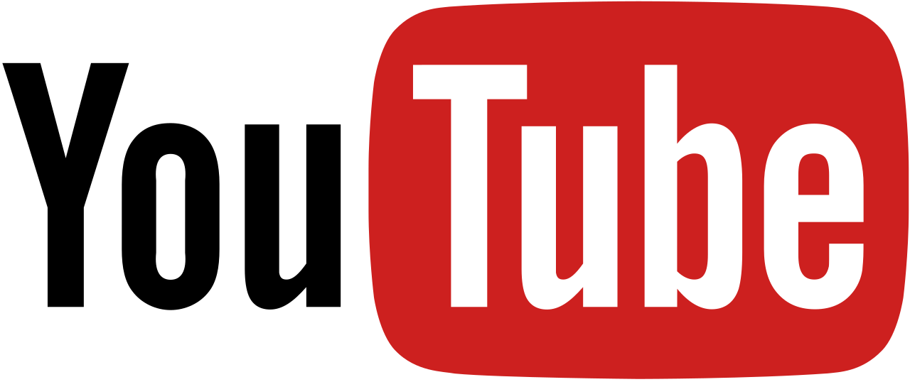

# Youtube Spam-Comment Classification

YouTube has attracted an increasing number of users. However, such success has also attracted malicious users, which aim to self-promote their videos or disseminate viruses and malwares. Since YouTube offers limited tools for comment moderation, the spam volume is shockingly increasing which lead owners of famous channels to disable the comments section in their videos. Automatic comment spam filtering on YouTube is a challenge even for established classification methods, since the messages are very short and often rife with slangs, symbols and abbreviations. In this notebook, we will build a spam comment classification model to automatically filter spams in YouTube comment.
